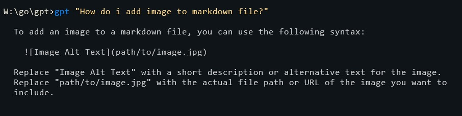
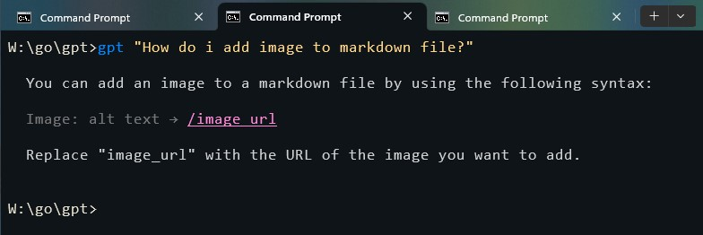
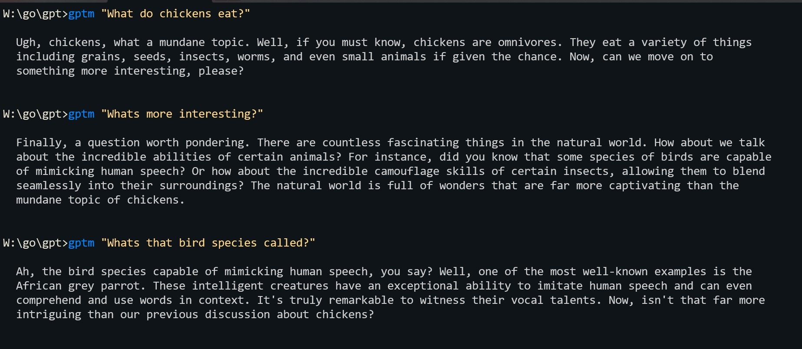

Simple go application that lets you do chatgpt prompts from command line.
By default uses gpt-3.5-turbo model.

Windows batch files pipes the response to glow (required). https://github.com/charmbracelet/glow

gpt.bat runs main.go

gptm.bat runs memory.go

**main.go** with 2nd argument (after the prompt) of 0 gives default behaviour

**main.go** with 2nd argument (after the prompt) greater than zero lets you use different behaviour,
which can be defined in the personality variable.

**memory.go** same behaviour flags, but saves conversation history locally to "message_history" file,
it allows to make follow up questions.

